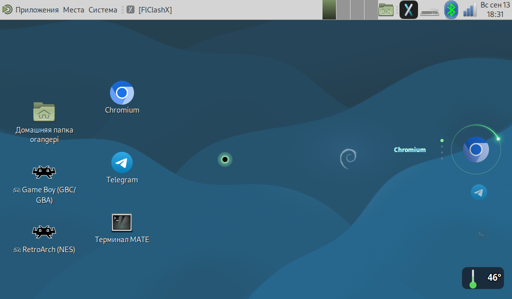

# Курсор-комета (X11 / MATE / GTK3)

Кастомный курсор с собственной отрисовкой: **чёрное ядро + светящийся ореол +
затухающий хвост**. Системный курсор при этом скрывается полностью.

Проверено на **Orange Pi Zero 3W** (Debian 13 Trixie, MATE, X11, 1024×600).



## Состав

| Файл | Назначение |
|---|---|
| `cursor-comet.py` | сам курсор: рисует комету и следует за мышью (60 fps) |
| `make_empty_cursor.py` | создаёт невидимую тему курсора (`comet-hidden`) |
| `autostart/cursor-comet.desktop` | автозапуск при входе в систему |

## Установка

**Быстрый путь (copy-paste всех команд):** см. **[INSTALL.md](INSTALL.md)** — просто
вставляй блоки в терминал по порядку.

Ниже — что именно делается:

```bash
# 1. зависимости (Debian 13)
sudo apt install python3-gi python3-gi-cairo python3-xlib gir1.2-gtk-3.0

# 2. код
install -m 755 cursor-comet.py make_empty_cursor.py ~/.local/bin/

# 3. невидимая тема курсора
python3 ~/.local/bin/make_empty_cursor.py

# 4. автозапуск
install -Dm 644 autostart/cursor-comet.desktop ~/.config/autostart/

# 5. запуск (пока без скрытия системного — проверить, что комета следует за мышью)
~/.local/bin/cursor-comet.py

# 6. когда убедился — с автоскрытием системного курсора
~/.local/bin/cursor-comet.py --hide-cursor
```

**Откат в любой момент:** `pkill -f cursor-comet.py` — скрипт сам вернёт
системный курсор и прежнюю тему.

## Как скрывается системный курсор (три механизма)

1. **Невидимая тема курсора** `comet-hidden` — 122 прозрачных курсора,
   сгенерированных вручную в формате Xcursor. Закрывает GTK-приложения.
2. **Пустой root-курсор** (`xsetroot -cursor empty.xbm empty.xbm`) — рабочий
   стол. XFixes для этого не работает (см. грабли).
3. **Тема GNOME + MATE** (`gsettings ... cursor-theme`) — чтобы новые
   приложения подхватывали тему автоматически.

## Грабли (проверено на практике)

- **`XFixesHideCursor` не работает** на этом драйвере (`sunxi-drm`): расширение
  присутствует, но курсор не скрывается — ни для root, ни для всех окон.
  Не тратьте время: сразу делайте невидимую тему + пустой root-курсор.
- **Тема должна содержать НЕСКОЛЬКО размеров курсора** (16/24/32/48). Если
  только один — Chromium не находит нужный и рисует **свой** курсор. Именно
  это решило проблему в Chromium.
- **Панель MATE перекрывает окно курсора**, если оно управляется WM. Решение:
  `set_override_redirect(True)` (окно становится неподвластно WM) — комета
  видна поверх панели стабильно.
- **Мерцание** — если окно полноэкранное (1024×600), композитор на софт-рендере
  (llvmpipe) не успевает. Решение: окно **96×96**, следующее за курсором.
- **Окно должно быть прозрачно для кликов**: `input_shape_combine_region(
  cairo.Region(), 0, 0)` + применить в `map-event` (при realize сбрасывается).
- **Qt-приложения (Telegram)** рисуют курсор сами и игнорируют тему — там
  стрелка остаётся. На Chromium/GTK/рабочем столе всё скрывается.
- **Хвост должен затухать по времени** (TTL 0.45 с), иначе точки висят, пока
  не двинешь мышь. И перерисовывать надо даже при неподвижном курсоре.

## Проверка (объективная)

Скриншот обычным `scrot` курсор не покажет. Нужен захват с `-draw_mouse 1`:

```bash
ffmpeg -f x11grab -video_size 1024x600 -i :0 -frames:v 1 -draw_mouse 1 -y /tmp/shot.png
```

## Настройки в коде

В начале `cursor-comet.py`: `CORE_R` (ядро), `HALO_R` (ореол), `NEON` (цвет),
`TTL` (длина хвоста), `W/H` (размер окна), частота — `GLib.timeout_add(16, ...)`.


